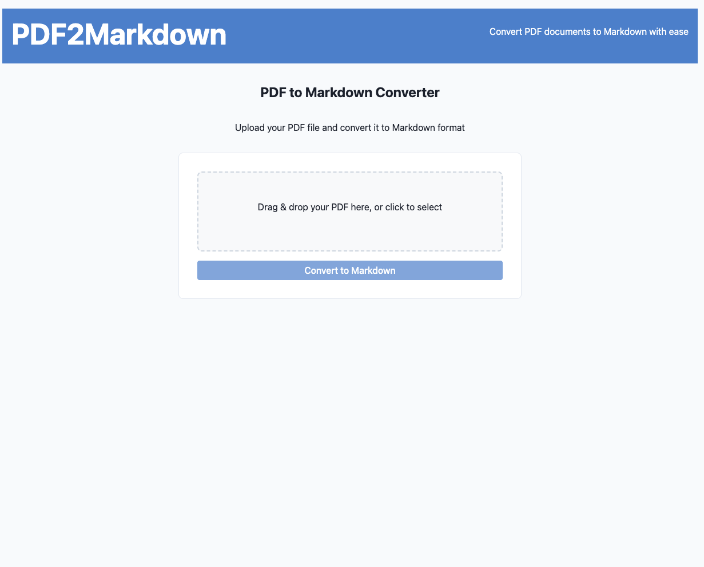

# PDF2Markdown

A modern web application for converting PDF documents to Markdown format with a clean, responsive UI.



## Features

- 📄 Convert PDF files to well-formatted Markdown
- 🖱️ Simple drag-and-drop interface
- 👁️ Real-time Markdown preview
- 💾 Easy download of converted Markdown files
- 📱 Fully responsive design
- 🚀 Kubernetes-ready deployment

## Tech Stack

### Backend
- Node.js + Express
- TypeScript
- PDF-parse for PDF extraction
- Multer for file uploads

### Frontend
- React
- TypeScript
- React Router
- React Dropzone
- Axios

### DevOps
- Docker multi-stage builds
- Kubernetes deployment manifests
- Nginx for serving frontend

## Quick Start

Use the provided startup script to run both backend and frontend:

```bash
./start.sh
```

### Manual Setup

#### Backend Setup

```bash
cd backend
npm install
npm run dev
```

The backend will be available at http://localhost:3000.

#### Frontend Setup

```bash
cd frontend
npm install
npm run dev
```

The frontend development server will be available at http://localhost:5173.

## Building Docker Images

### Backend

```bash
cd backend
docker build -t pdf2markdown-backend:latest .
```

### Frontend

```bash
cd frontend
docker build -t pdf2markdown-frontend:latest .
```

## Kubernetes Deployment

The application can be deployed to Kubernetes using the provided manifests in the `k8s` directory.

```bash
kubectl apply -f k8s/
```

## Configuration

### Backend Environment Variables

- `PORT`: Server port (default: 3000)
- `NODE_ENV`: Environment (development, production)
- `UPLOAD_LIMIT`: Maximum file upload size (default: 10mb)
- `CORS_ORIGIN`: Allowed origins for CORS

### Frontend Environment Variables

- `VITE_API_URL`: Backend API URL

## Development

### Project Structure

```
pdf2markdown/
├── backend/             # Node.js Express backend
│   ├── src/             # TypeScript source code
│   ├── uploads/         # PDF upload directory
│   └── Dockerfile       # Backend Docker configuration
├── frontend/            # React frontend
│   ├── src/             # TypeScript source code
│   ├── public/          # Static assets
│   └── Dockerfile       # Frontend Docker configuration
├── k8s/                 # Kubernetes manifests
│   ├── backend-deployment.yaml
│   ├── frontend-deployment.yaml
│   └── ingress.yaml
└── start.sh             # Development startup script
```

## How It Works

1. **Upload**: User uploads a PDF file via drag-and-drop or file selection
2. **Convert**: Backend processes the PDF and extracts text with formatting
3. **Preview**: Frontend displays a real-time preview of the Markdown
4. **Download**: User can download the converted Markdown file

## License

This project is licensed under the Apache License 2.0 - see the LICENSE file for details.

## Contributing

Contributions are welcome! Please feel free to submit a Pull Request.

1. Fork the repository
2. Create your feature branch (`git checkout -b feature/amazing-feature`)
3. Commit your changes (`git commit -m 'Add some amazing feature'`)
4. Push to the branch (`git push origin feature/amazing-feature`)
5. Open a Pull Request 